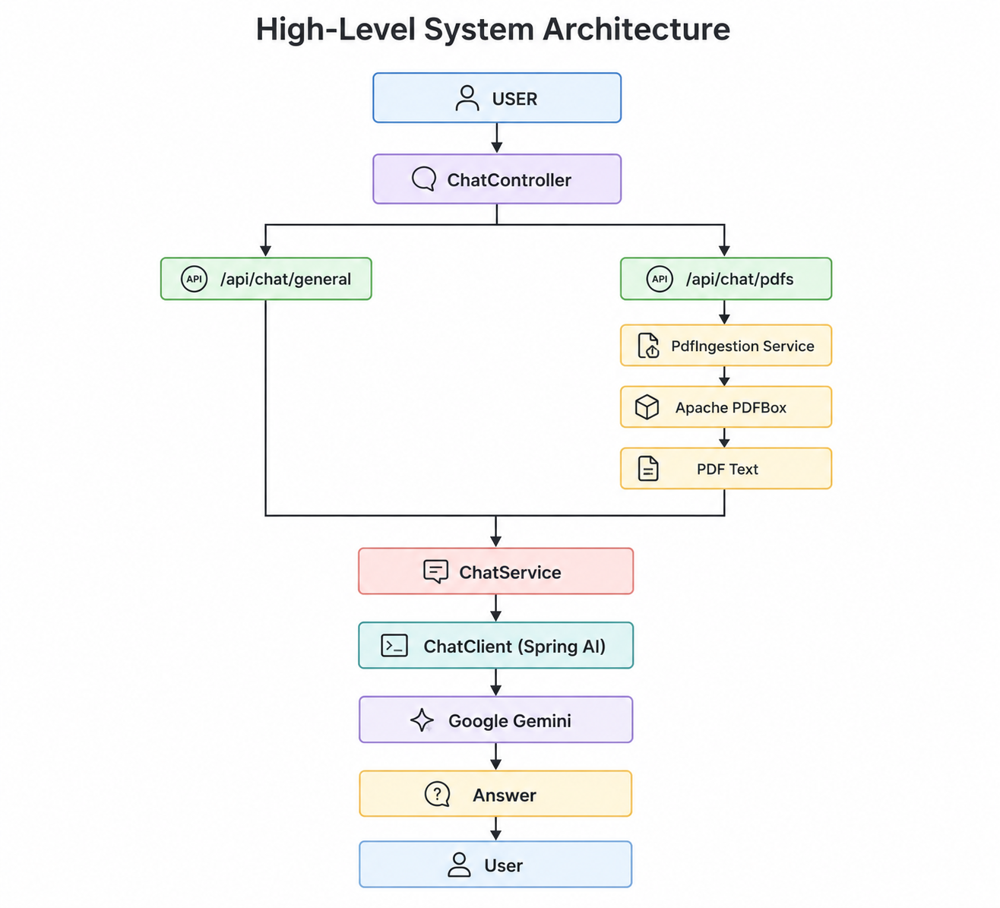
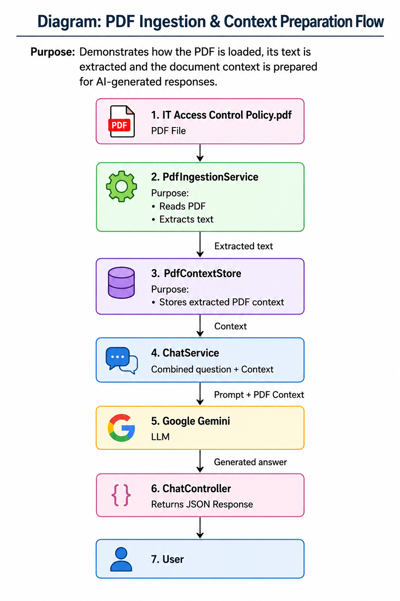
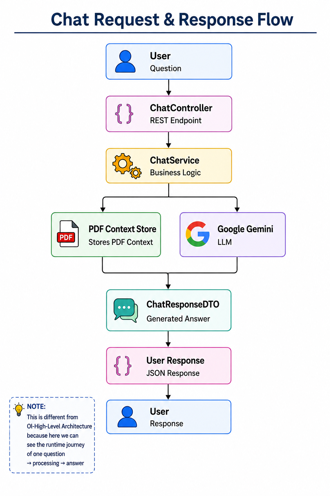
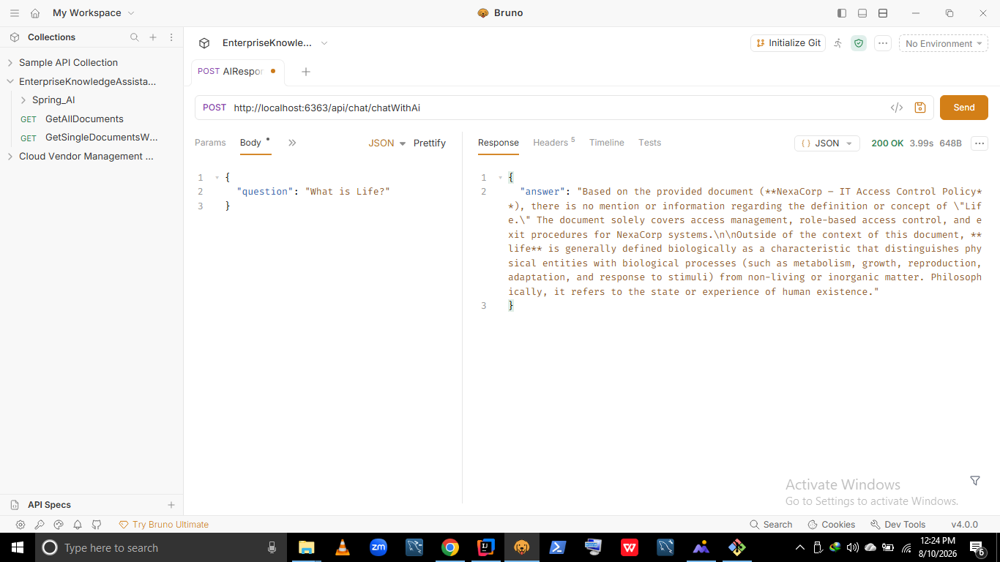
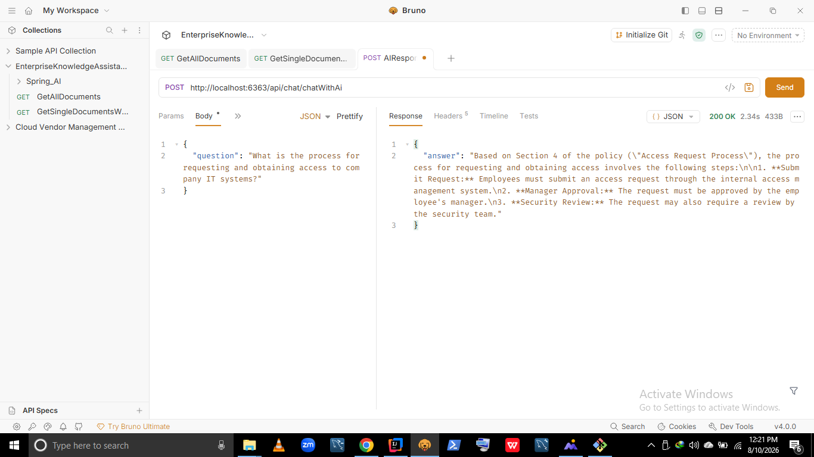
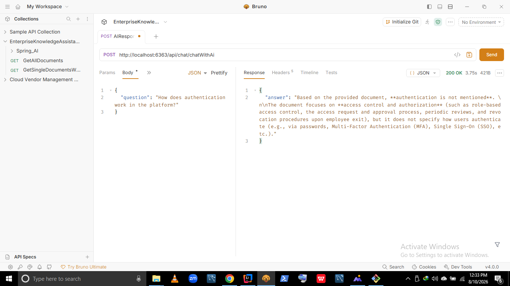
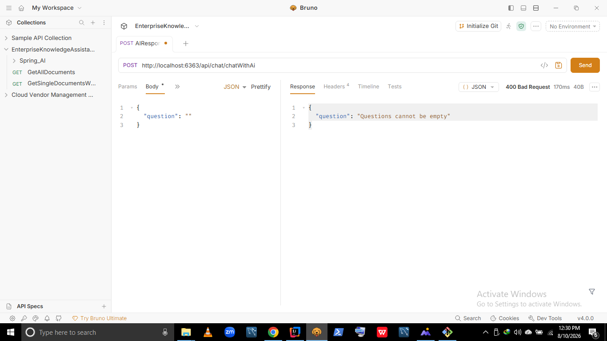
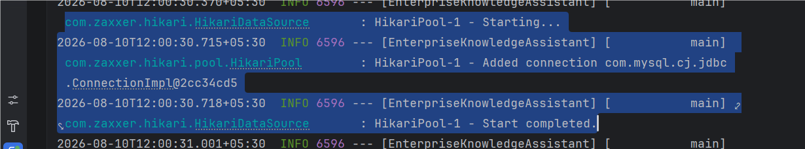

# 🤖 Enterprise Knowledge Assistant – Spring Boot & Google Gemini

A practical **Spring Boot AI backend application** demonstrating **REST API development, Google Gemini integration, PDF document processing with Apache PDFBox, DTO validation, MySQL connectivity, and clean layered architecture**.

Built with a strong focus on **Java backend fundamentals, AI integration, document-based question answering, API design, and production-oriented development patterns**, suitable for Java Backend Developer and AI-enabled backend roles.

<p align="center">


</p>

---

## 🚀 Tech Stack

| Category | Technology |
|---|---|
| **Language** | Java 21 |
| **Framework** | Spring Boot 3.5.6 |
| **AI Integration** | Spring AI 1.1.8 + Google Gemini |
| **PDF Processing** | Apache PDFBox 3.0.6 |
| **Database** | MySQL |
| **Persistence** | Spring Data JPA / Hibernate |
| **API** | Spring Web / REST |
| **Validation** | Jakarta Bean Validation |
| **Build Tool** | Maven |
| **Testing** | Spring Boot Test |
| **API Testing** | Postman |
| **Monitoring** | Spring Boot Actuator |
---

## 🧩 Architecture Overview

The application follows a clean **layered architecture** where the REST API receives the user's question, the service layer prepares the available PDF context, and Google Gemini generates the final response.

### Request Flow

```text
User
 ↓
ChatController
 ↓
ChatService
 ↓
PdfContextStore
 ↓
Google Gemini
 ↓
ChatResponse
 ↓
User
```

### Architecture Diagram


---

## 📄 PDF Ingestion & AI Processing

The application uses **Apache PDFBox** to load an enterprise PDF and extract its text. The extracted content is temporarily stored and then provided to Google Gemini along with the user's question.

### Processing Flow

```text
PDF Document
     ↓
PdfIngestionService
     ↓
Apache PDFBox
     ↓
Text Extraction
     ↓
PdfContextStore
     ↓
ChatService
     ↓
PDF Context + User Question
     ↓
Google Gemini
     ↓
AI Response
```

### PDF Ingestion Architecture



### Key Components

| Component | Responsibility |
|---|---|
| **PdfIngestionService** | Loads PDF files and extracts text using Apache PDFBox |
| **PdfContextStore** | Temporarily stores the extracted PDF text |
| **ChatService** | Combines the PDF context with the user's question |
| **ChatController** | Exposes the REST API |
| **Google Gemini** | Generates the final AI response |

> **Current implementation:** The application uses direct PDF text context with Gemini. It does not currently use embeddings, a vector database, or semantic similarity search.

---

## 💬 Chat API

The application exposes a REST API that accepts a user's question and returns an AI-generated response.

### Endpoint

```http
POST /api/chat/chatWithAi
```

### Request

```json
{
  "question": "How does NexaCorp's Role-Based Access Control work, and what happens to system access when an employee leaves the company?"
}
```

### Response

```json
{
  "answer": "Based on NexaCorp's IT Access Control Policy, access is assigned based on employee roles such as Engineering, HR, Support, and Operations. Elevated privileges are granted only when justified by business needs. Upon employee termination or role change, system access must be reviewed and adjusted, and access to critical systems must be revoked immediately upon exit."
}
```

### API Flow

```text
Client
  ↓
POST /api/chat/chatWithAi
  ↓
ChatController
  ↓
ChatService
  ↓
PDF Context + User Question
  ↓
Google Gemini
  ↓
ChatResponseDTO
  ↓
Client
```
### Chat Request & Response Flow



### API Demonstration

The application demonstrates both **general AI question answering** and **document-based question answering**.

#### General Question → AI Response

A general enterprise-related question is sent to the API and Google Gemini generates the response.



#### PDF-Based Question → AI Response

A question related to the uploaded enterprise PDF is sent to the API, and Google Gemini generates the response using the extracted PDF context.



#### PDF Query → Information Not Found

The application also handles questions where the requested information is not available in the uploaded PDF context.



---

## 🛡️ Validation & Error Handling

The API validates incoming requests using **Jakarta Bean Validation** and handles validation errors through a centralized `@RestControllerAdvice`.

### Invalid Request

```json
{
  "question": ""
}
```

### Error Response

```json
{
  "question": "Questions cannot be empty"
}
```

### Error Handling Flow

```text
Invalid Request
      ↓
@Valid
      ↓
Validation Failure
      ↓
MethodArgumentNotValidException
      ↓
GlobalExceptionHandler
      ↓
HTTP 400 Bad Request
```

### Error Handling Architecture

> Error-handling architecture diagram can be added here when the dedicated diagram is available.

### Validation Error Demonstration



### Implementation

- Request validation using `@Valid`
- Field validation using DTO annotations
- Centralized exception handling using `@RestControllerAdvice`
- Consistent HTTP `400 Bad Request` response

---

## 🗄️ MySQL Database

The application uses **MySQL** with **Spring Data JPA and Hibernate** for database connectivity and persistence.

### Database Flow

```text
Enterprise Knowledge Assistant
            ↓
      Spring Data JPA
            ↓
         Hibernate
            ↓
        JDBC / HikariCP
            ↓
           MySQL
```

### Database Configuration

Database credentials are supplied through environment variables instead of being hardcoded in the application.

```properties
spring.datasource.url=jdbc:mysql://localhost:3306/EnterpriseKnowledgeAssistant?useSSL=false
spring.datasource.username=root
spring.datasource.password=${DB_PASSWORD}
```

### Security

- Database password is stored using the `DB_PASSWORD` environment variable.
- Gemini API credentials are also provided through environment variables.
- Sensitive credentials are not committed to the GitHub repository.

### Database Connectivity Demonstration



---

## 📌 Current Capabilities

The application currently demonstrates:

- REST API development using Spring Boot
- Google Gemini integration using Spring AI
- PDF document ingestion using Apache PDFBox
- PDF text extraction
- Document-context-based AI question answering
- General AI question answering
- Handling of questions where information is not found in the PDF
- Request validation using Jakarta Bean Validation
- Centralized exception handling
- MySQL database connectivity
- Spring Data JPA and Hibernate
- Maven-based project management
- API testing using Postman
- Spring Boot Actuator for monitoring

---

## ⚠️ Current Architecture Limitation

The current implementation uses **direct PDF text context** for AI question answering.

It does **not currently implement**:

- Embeddings
- Vector database
- Semantic similarity search
- Chunk-level retrieval
- Full production RAG pipeline

The current implementation focuses on understanding the fundamentals of **Spring Boot + AI integration + document processing + REST API development**.

---

## 🔐 Configuration & Security

Sensitive configuration values are provided through environment variables.

Example:

```properties
spring.datasource.password=${DB_PASSWORD}
```

Gemini API credentials are also supplied through environment variables.

Sensitive credentials should never be committed to the GitHub repository.

---

## 🧪 Testing

The REST APIs are tested using **Postman**.

The project includes demonstrations for:

- Successful general AI response
- Successful PDF-based AI response
- PDF query where information is not found
- Invalid request validation
- MySQL connectivity

---

## 📁 Project Structure

```text
EnterpriseKnowledgeAssistant
│
├── src
│   └── main
│       ├── java
│       │   └── com
│       │       └── ...
│       │
│       └── resources
│           └── application.properties
│
├── docs
│   └── screenshots
│       ├── 01-spring-boot-application-started.png
│       ├── 02-mysql-database-connection.png
│       ├── 03_IT_Access_Control_PDF_Query.png
│       ├── 04_General_AI_Response.png
│       ├── 05_Invalid_Request_Error_Handling.png
│       └── 06_PDF_Based_Query_No_Information_Found.png
│
├── pom.xml
└── README.md
```

---

## 🎯 Project Purpose

This project was built to strengthen practical backend development skills while integrating modern AI capabilities into a Java/Spring Boot application.

The primary focus areas are:

**Java → Spring Boot → REST APIs → PDF Processing → Gemini AI → Validation → Database Connectivity → Clean Backend Architecture**

---
## 👨‍💻 Author

**Sidharth Kumar**  

[](mailto:siddharth0161820@gmail.com)  
[](https://www.linkedin.com/in/siddharthkumar16)  
[](https://github.com/siddharth0161820)

🙏 Built with dedication to strengthen practical backend development skills and learn how to integrate AI capabilities into Java and Spring Boot applications. Connect for collaboration, job opportunities, or tech discussions.


