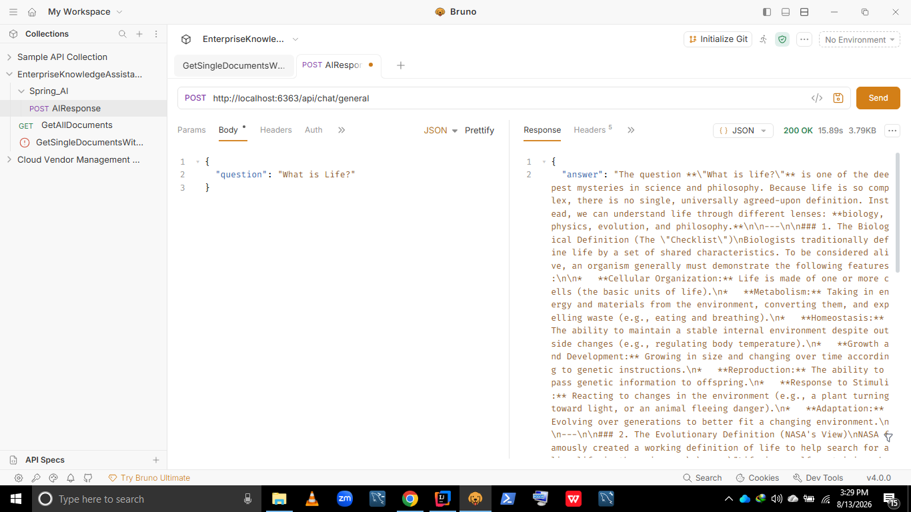
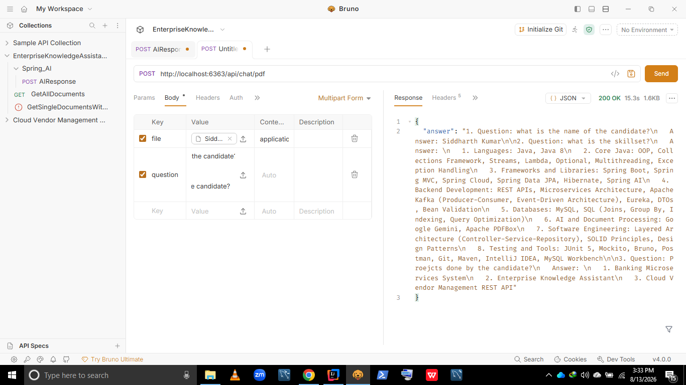
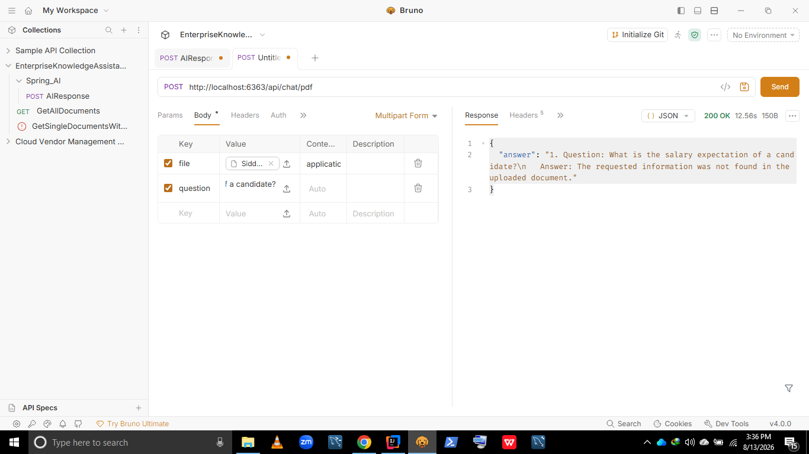
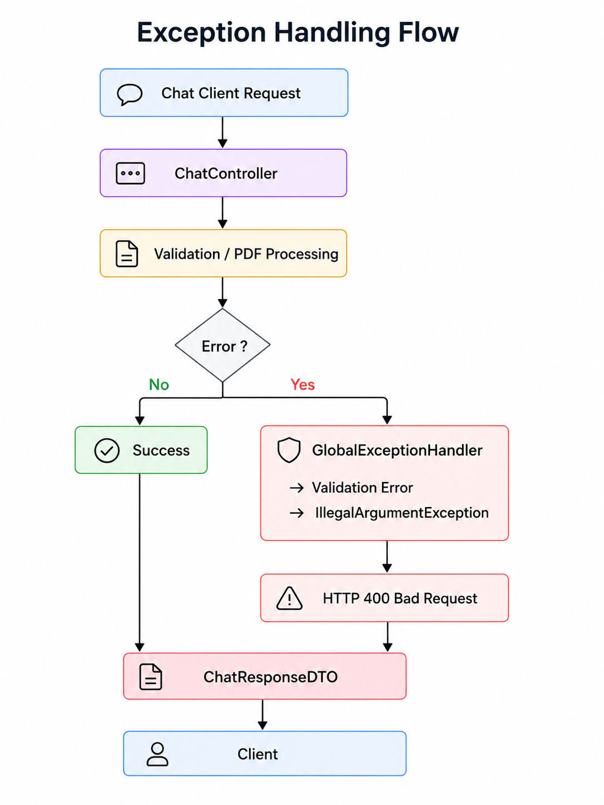
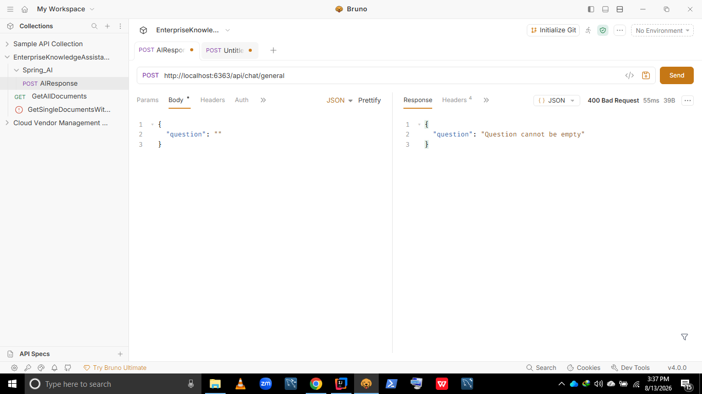
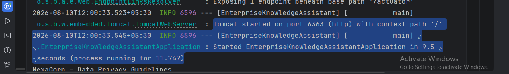

# 🤖 Enterprise Knowledge Assistant – Spring Boot & Google Gemini

A practical **Spring Boot AI backend application** demonstrating **REST API development, Google Gemini integration, dynamic PDF document processing with Apache PDFBox, DTO validation, MySQL connectivity, and clean layered architecture**.

The application supports two AI use cases:

- **General AI question answering** using Google Gemini
- **Dynamic PDF-based question answering**, where a user can upload a readable PDF and ask questions based on its content

Built with a strong focus on **Java backend development, Spring Boot, REST APIs, AI integration, document processing, validation, exception handling, database connectivity, and clean backend architecture**, making it suitable for Java Backend Developer and AI-enabled backend roles.

<p align="center">


</p>

---

## 🚀 Tech Stack

| Category | Technology |
|---|---|
| **Language** | Java 21 |
| **Framework** | Spring Boot 3.5.6 |
| **AI Integration** | Spring AI 1.1.8 + Google Gemini |
| **PDF Processing** | Apache PDFBox 3.0.6 |
| **Database** | MySQL |
| **Persistence Framework** | Spring Data JPA / Hibernate |
| **API Development** | Spring Web / REST |
| **Validation** | Jakarta Bean Validation |
| **Build Tool** | Maven |
| **Testing** | Spring Boot Test |
| **API Testing** | Bruno |
| **Monitoring** | Spring Boot Actuator |
| **Architecture** | Layered Controller-Service Architecture |

---

## 🧩 Architecture Overview

The application follows a clean **layered backend architecture**.

The REST controller receives requests and delegates business logic to the service layer. The service communicates with Spring AI's `ChatClient`, while the PDF flow additionally uses `PdfIngestionService` and Apache PDFBox to extract text from the uploaded document.

### General AI Flow

```text
User
  ↓
ChatController
  ↓
ChatService
  ↓
ChatClient
  ↓
Google Gemini
  ↓
ChatResponseDTO
  ↓
User
```

### PDF Question Answering Flow

```text
User
  ↓
ChatController
  ↓
ChatService
  ↓
PdfIngestionService
  ↓
Apache PDFBox
  ↓
Extract PDF Text
  ↓
ChatService
  ↓
ChatClient
  ↓
Google Gemini
  ↓
ChatResponseDTO
  ↓
User
```

### High-Level System Architecture


---

## 📄 PDF Ingestion & AI Processing

The application supports **dynamic PDF uploads**.

A user does not need to place a predefined PDF inside the project. The PDF is uploaded directly through the REST API request.

`PdfIngestionService` uses **Apache PDFBox** to:

1. Receive the uploaded `MultipartFile`
2. Validate that the file is not empty
3. Load the PDF
4. Extract readable text
5. Reject PDFs without readable text
6. Return the extracted text to the service layer

The extracted PDF text is then combined with the user's question and sent to Google Gemini.

### PDF Processing Flow

```text
Uploaded PDF
     ↓
ChatController
     ↓
ChatService
     ↓
PdfIngestionService
     ↓
Apache PDFBox
     ↓
PDF Text Extraction
     ↓
PDF Text + User Question
     ↓
ChatClient / Spring AI
     ↓
Google Gemini
     ↓
AI Response
```

### PDF Ingestion & AI Processing Architecture


### Key Components

| Component | Responsibility |
|---|---|
| **ChatController** | Exposes the general AI and PDF question-answering REST endpoints |
| **ChatService** | Contains the main AI business logic |
| **PdfIngestionService** | Extracts readable text from uploaded PDF files |
| **Apache PDFBox** | Performs PDF loading and text extraction |
| **AiConfiguration** | Creates and configures the Spring AI `ChatClient` bean |
| **ChatClient** | Sends prompts to the configured AI model |
| **Google Gemini** | Generates the final AI response |
| **ChatRequestDTO** | Represents validated general AI requests |
| **ChatResponseDTO** | Represents the AI response returned to the client |
| **GlobalExceptionHandler** | Handles validation and invalid-input errors centrally |

> **Current implementation:** The application directly extracts PDF text and sends that text as context to Gemini. It does not currently use embeddings, a vector database, semantic similarity search, chunk-level retrieval, or a persistent RAG pipeline.

---

## 💬 Chat APIs

The application exposes two separate REST endpoints.

### 1. General AI

This endpoint sends a normal text question directly to Google Gemini.

#### Endpoint

```http
POST /api/chat/general
```

#### Request

```json
{
  "question": "what is Life in one sentence?"
}
```

#### Response

```json
{
  "answer": "Life is a continuous journey of growth and change, where meaning is not given to us, but created through how we love, learn, and experience the world."
}
```

---

### 2. PDF-Based Question Answering

This endpoint accepts a PDF file and a question.

#### Endpoint

```http
POST /api/chat/pdf
```

#### Content Type

```http
multipart/form-data
```

#### Request Parts

```text
file      → Any readable PDF
question  → Question related to the uploaded PDF
```

Example:

```text
file:
candidate-resume.pdf

question:
What is the name of the candidate?
```

#### Response

```json
{
  "answer": "1. Question: What is the name of the candidate?\n   Answer: Siddharth Kumar"
}
```

The PDF endpoint can process **different PDFs uploaded by the user at request time**.

---

## 🔄 API Request & Response Flow

```text
                         ┌─────────────────────┐
                         │       Client        │
                         └──────────┬──────────┘
                                    │
                     ┌──────────────┴──────────────┐
                     │                             │
                     ▼                             ▼
            /api/chat/general              /api/chat/pdf
                     │                             │
                     ▼                             ▼
              ChatController               ChatController
                     │                             │
                     ▼                             ▼
                ChatService                  ChatService
                     │                             │
                     │                    PdfIngestionService
                     │                             │
                     │                       Apache PDFBox
                     │                             │
                     │                       Extracted Text
                     │                             │
                     └──────────────┬──────────────┘
                                    │
                                    ▼
                               ChatClient
                                    │
                                    ▼
                              Google Gemini
                                    │
                                    ▼
                            ChatResponseDTO
                                    │
                                    ▼
                                  Client
```

### API Request & Response Architecture


---

## 🧪 API Demonstration

The application demonstrates both **general AI question answering** and **document-based question answering**.

### General Question → AI Response

A normal question is sent to the `/api/chat/general` endpoint and Google Gemini generates the response.



### PDF Question → AI Response

A PDF is uploaded through `/api/chat/pdf`.

Apache PDFBox extracts the PDF text, and the extracted content is provided to Gemini along with the user's question.



### PDF Query → Information Not Found

For PDF-based questions, the prompt instructs Gemini to answer using **only the uploaded PDF content**.

If the requested information is not available in the document, the response is:

```text
The requested information was not found in the uploaded document.
```



---

## 🛡️ Validation & Error Handling

The application uses **Jakarta Bean Validation** and centralized exception handling through `@RestControllerAdvice`.

### General AI Validation

The `ChatRequestDTO` contains:

```java
@NotBlank(message = "Question cannot be empty")
private String question;
```

An empty request:

```json
{
  "question": ""
}
```

returns:

```json
{
  "question": "Question cannot be empty"
}
```

with:

```http
HTTP 400 Bad Request
```

### PDF Validation

The PDF ingestion service validates:

- Missing PDF file
- Empty PDF file
- PDF without readable text
- PDF processing failures

Examples of handled errors include:

```text
PDF file cannot be empty
```

and:

```text
PDF does not contain readable text
```

### Error Handling Flow

```text
Client Request
      ↓
ChatController
      ↓
Validation / PDF Processing
      ↓
    Exception?
      │
      ▼
GlobalExceptionHandler
      │
      ├── MethodArgumentNotValidException
      │
      └── IllegalArgumentException
      │
      ▼
HTTP 400 Bad Request
```

### Exception Handling Architecture



### Validation Error Demonstration



### Implementation

- `@Valid` for request validation
- `@NotBlank` for required questions
- `@RestControllerAdvice` for centralized exception handling
- `MethodArgumentNotValidException` handling
- `IllegalArgumentException` handling
- HTTP `400 Bad Request` responses

---

## 🗄️ MySQL Database

The project is configured with **MySQL**, Spring Data JPA, and Hibernate.

The current application does not contain custom JPA entities or repositories for storing PDF documents. MySQL is currently configured as part of the backend infrastructure and its connectivity is demonstrated during application startup.

### Database Flow

```text
Spring Boot Application
          ↓
   Spring Data JPA
          ↓
       Hibernate
          ↓
      JDBC / HikariCP
          ↓
         MySQL
```

### Database Configuration

```properties
spring.datasource.url=jdbc:mysql://localhost:3306/EnterpriseKnowledgeAssistant?useSSL=false
spring.datasource.username=root
spring.datasource.password=${DB_PASSWORD}
spring.datasource.driver-class-name=com.mysql.cj.jdbc.Driver
```

### Security

Database credentials are not hardcoded.

The application uses:

```text
DB_PASSWORD
```

for the MySQL password.

The Gemini API key is also provided through:

```text
GEMINI_API_KEY
```

Sensitive credentials should never be committed to the GitHub repository.

### MySQL Connectivity Demonstration


---

## ⚙️ Configuration

The application uses environment variables for sensitive configuration.

### Environment Variables

```text
DB_PASSWORD=your_mysql_password
GEMINI_API_KEY=your_gemini_api_key
```

### Application Properties

```properties
spring.application.name=EnterpriseKnowledgeAssistant
server.port=6363

spring.datasource.url=jdbc:mysql://localhost:3306/EnterpriseKnowledgeAssistant?useSSL=false
spring.datasource.username=root
spring.datasource.password=${DB_PASSWORD}
spring.datasource.driver-class-name=com.mysql.cj.jdbc.Driver

spring.jpa.hibernate.ddl-auto=update
spring.jpa.show-sql=true

spring.ai.google.genai.api-key=${GEMINI_API_KEY}
spring.ai.google.genai.chat.options.model=gemini-flash-latest

spring.servlet.multipart.max-file-size=100MB
spring.servlet.multipart.max-request-size=100MB
```

---

## ▶️ Running the Application

### 1. Clone the Repository

```bash
git clone <your-repository-url>
cd EnterpriseKnowledgeAssistant
```

### 2. Configure Environment Variables

Set the following environment variables:

```text
DB_PASSWORD
GEMINI_API_KEY
```

### 3. Start the Application

Using Maven:

```bash
mvn spring-boot:run
```

The application runs on:

```text
http://localhost:6363
```

### 4. Test Using Bruno

The APIs can be tested using Bruno or another REST API client.

#### General AI

```http
POST http://localhost:6363/api/chat/general
```

Request:

```json
{
  "question": "what is Life in one sentence?"
}
```

#### PDF Question Answering

```http
POST http://localhost:6363/api/chat/pdf
```

Use:

```text
Content-Type: multipart/form-data

file      → any readable PDF
question  → question related to the PDF
```

---

## 📌 Current Capabilities

The application currently demonstrates:

- REST API development using Spring Boot
- Separate general AI and PDF-based AI endpoints
- Google Gemini integration using Spring AI
- Dynamic PDF upload at request time
- PDF text extraction using Apache PDFBox
- Document-context-based AI question answering
- PDF-only answering for document queries
- Information-not-found handling
- Request validation using Jakarta Bean Validation
- Centralized exception handling
- HTTP 400 error handling
- MySQL database connectivity
- Spring Data JPA and Hibernate configuration
- Environment-based secret management
- Multipart file upload
- Maven-based project management
- API testing using Bruno
- Spring Boot Actuator

---

## ⚠️ Current Architecture Limitation

The current PDF question-answering implementation uses **direct PDF text extraction and context injection**.

It does not currently implement:

- Embeddings
- Vector database
- Semantic similarity search
- Chunk-level retrieval
- Retrieval-Augmented Generation (RAG)
- Persistent document storage
- OCR for scanned/image-only PDFs

The current architecture intentionally focuses on the fundamentals of:

```text
Spring Boot
     ↓
REST APIs
     ↓
PDF Processing
     ↓
Spring AI
     ↓
Google Gemini
     ↓
Document-Based Question Answering
```

This provides a straightforward foundation that can later be extended into a full RAG-based architecture.

---

## 🧪 Testing

The REST APIs are tested using **Bruno**.

The project includes demonstrations for:

| Test Scenario | Endpoint | Expected Result |
|---|---|---|
| General AI Question | `/api/chat/general` | Gemini-generated response |
| PDF Question | `/api/chat/pdf` | Answer based on uploaded PDF |
| PDF Information Not Found | `/api/chat/pdf` | Information-not-found response |
| Empty Question | `/api/chat/general` | HTTP 400 Bad Request |
| Empty PDF | `/api/chat/pdf` | HTTP 400 Bad Request |
| Unreadable PDF | `/api/chat/pdf` | HTTP 400 Bad Request |
| MySQL Connectivity | Application startup | Database connection established |

---

## 📸 Application Demonstrations

### 1. Spring Boot Application Started



### 2. MySQL Database Connection


### 3. General AI Response


### 4. PDF Question and Answer


### 5. PDF Information Not Found


### 6. Validation Error Handling


---

## 📁 Project Structure

```text
EnterpriseKnowledgeAssistant
│
├── src
│   └── main
│       ├── java
│       │   └── com
│       │       └── Siddharth
│       │           └── EnterpriseKnowledgeAssistant
│       │               │
│       │               ├── AI
│       │               │   ├── ChatControllerLayer
│       │               │   │   └── ChatController.java
│       │               │   │
│       │               │   ├── ChatDTO
│       │               │   │   ├── ChatRequestDTO.java
│       │               │   │   └── ChatResponseDTO.java
│       │               │   │
│       │               │   ├── ChatServiceLayer
│       │               │   │   ├── ChatService.java
│       │               │   │   └── ChatServiceImplementation.java
│       │               │   │
│       │               │   ├── Config
│       │               │   │   └── AiConfiguration.java
│       │               │   │
│       │               │   ├── GlobalExceptionHandling
│       │               │   │   └── GlobalExceptionHandler.java
│       │               │   │
│       │               │   └── Ingestion
│       │               │       └── pdf
│       │               │           └── PdfIngestionService.java
│       │               │
│       │               └── EnterpriseKnowledgeAssistantApplication.java
│       │
│       └── resources
│           └── application.properties
│
├── docs
│   ├── architecutre
│   │   ├── 01_High_Level_System_Architecture.png
│   │   ├── 02_PDF_Ingestion_and_AI_Processing_Flow.png
│   │   ├── 03_API_Request_Response_Flow.png
│   │   └── 04_Exception_Handling_Flow.png
│   │
│   ├── 01-spring-boot-application-started.png
│   ├── 02-mysql-database-connection.png
│   ├── 03-general-ai-response.png
│   ├── 04-pdf-question-answer.png
│   ├── 05-pdf-information-not-found.png
│   └── 06-validation-error-handling.png
│
├── pom.xml
└── README.md
```

> Note: The architecture folder is currently named `architecutre` in the project. The README references the folder using that exact name so the GitHub image paths match the current repository structure.

---

## 🎯 Project Purpose

This project was built to strengthen practical backend development skills while integrating modern AI capabilities into a Java/Spring Boot application.

The primary focus areas are:

**Java → Spring Boot → REST APIs → PDF Processing → Spring AI → Google Gemini → Validation → Exception Handling → Database Connectivity → Clean Backend Architecture**

The application demonstrates how a Java backend can support both:

```text
General AI Questions
        +
User-Uploaded PDF Questions
        ↓
Google Gemini
        ↓
AI-Generated Response
```

The project emphasizes a clean and understandable backend implementation that can serve as a foundation for future AI and RAG-based enhancements.

---

## 👨‍💻 Author

**Siddharth Kumar**

[](mailto:siddharth0161820@gmail.com)

[](https://www.linkedin.com/in/siddharthkumar16)

[](https://github.com/siddharth0161820)

🙏 Built with dedication to strengthen practical backend development skills and learn how to integrate AI capabilities into Java and Spring Boot applications. Connect for collaboration, job opportunities, or tech discussions.


